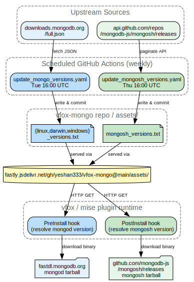

# vfox-mongo plugin

<div align="center">

[](https://github.com/yeshan333/vfox-mongo/actions/workflows/e2e_test.yaml)

</div>

mongo [vfox](https://github.com/version-fox) plugin. Use the vfox to manage multiple mongo server versions in Linux/Darwin/Windows. vfox-mongo plugin would download and install the mongo server version from : [https://www.mongodb.com/download-center/community/releases/archive].

**mongosh auto-install**: Since MongoDB 6.0+, the legacy `mongo` shell is no longer bundled in the server tarball. This plugin automatically installs the latest [mongosh](https://github.com/mongodb-js/mongosh) alongside the server. The mongosh version list is maintained in-repo ([`mongosh_versions.txt`](assets/mongosh_versions.txt)) and resolved at install time via the [jsdelivr CDN](https://fastly.jsdelivr.net/gh/yeshan333/vfox-mongo@main/assets/mongosh_versions.txt) — no live GitHub API call is made, avoiding rate-limit failures in CI environments.

To install a specific mongosh version, set the `MONGOSH_VERSION` environment variable:

```shell
MONGOSH_VERSION=2.8.3 vfox install mongo@8.0.6
```

## How it works

Both `mongod` and `mongosh` versions are maintained in this repo by scheduled GitHub Actions that scrape upstream metadata weekly and commit version lists under `assets/`. At install time the plugin resolves versions via the [jsdelivr CDN](https://fastly.jsdelivr.net/gh/yeshan333/vfox-mongo@main/assets/) — no live calls to GitHub API or MongoDB CDN are needed for version lookup, which avoids rate-limit failures in CI and keeps installs fast.



## Usage

### Install with vfox

```shell
# install plugin
vfox add --source https://github.com/yeshan333/vfox-mongo/archive/refs/heads/main.zip mongo

# search available versions
vfox search mongo

# install a specific version (platform is auto-detected)
vfox install mongo@8.0.6

# activate
vfox use -g mongo@8.0.6
```

### Install with mise

The vfox-mongo plugin can also be used through [mise](https://mise.jdx.dev/), which supports vfox plugins.

```shell
# install the plugin
mise plugin install mongo https://github.com/yeshan333/vfox-mongo/archive/refs/heads/main.zip

# search available versions
mise ls-remote mongo

# install and activate
mise use -g mongo@8.0.6

# run mongod
mongod --help
```

You can browse the maintained version lists under the [`assets/` directory](https://github.com/yeshan333/vfox-mongo/tree/main/assets) or via jsdelivr ([mongo](https://fastly.jsdelivr.net/gh/yeshan333/vfox-mongo@main/assets/) · [mongosh](https://fastly.jsdelivr.net/gh/yeshan333/vfox-mongo@main/assets/mongosh_versions.txt)).

